<a href="https://aravindshajan6.github.io/react-portfolio/">
  
</a>

  <a href="https://aravindshajan6.github.io/react-portfolio/"></a>
  <a href="https://www.linkedin.com/in/aravindshajan/"></a>
  <a href="mailto:aravindshajan6@gmail.com"></a>
  


### `~/stack`

  
   
  <code>+ playwright · socket.io · drizzle · anime.js · react-three-fiber · razorpay</code> — the ones that don't have an icon yet

### `~/featured`

  <a href="https://auctioneer.sapper.top/"></a>
  <a href="https://valodex.sapper.top"></a>

  <a href="https://sportscast.sapper.top"></a>
  <a href="https://ecommerce-dashboard-a3ap.onrender.com/"></a>

  <a href="https://elecstore-web.onrender.com/"></a>
  <a href="https://steaminc.onrender.com/"></a>

  source →
    <a href="https://github.com/aravindshajan6/auctioneer">auctioneer</a> ·
    <a href="https://github.com/aravindshajan6/valodex">valodex</a> ·
    <a href="https://github.com/aravindshajan6/SportsLive">sportscast</a> ·
    <a href="https://github.com/aravindshajan6/Ecommerce-Dashboard-Analytics">nova-commerce</a> ·
    <a href="https://github.com/aravindshajan6/ecommerce-app">elecstore</a> ·
    <a href="https://github.com/aravindshajan6/steaminc">steaminc</a>
  

### `~/client-work`

<a href="https://aravindshajan6.github.io/react-portfolio/#work">
  
</a>

### `~/career`


### `~/activity`

<picture>
  <source media="(prefers-color-scheme: dark)" srcset="https://raw.githubusercontent.com/aravindshajan6/aravindshajan6/output/snake-dark.svg">
  <source media="(prefers-color-scheme: light)" srcset="https://raw.githubusercontent.com/aravindshajan6/aravindshajan6/output/snake-light.svg">
  
</picture>

  

<code>psst — my portfolio has a hidden terminal</code>

 

Open [the portfolio](https://aravindshajan6.github.io/react-portfolio/) and hit <kbd>`</kbd> or <kbd>Ctrl</kbd>+<kbd>K</kbd>.
Try `neofetch`, `matrix`, `cd work`… or go straight for `sudo hire aravind`.

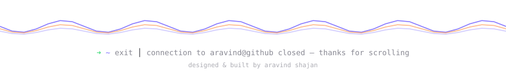

